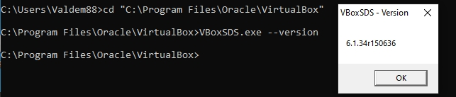

# 5.2. Применение принципов IaaC в работе с виртуальными машинами - dev-17_virt2-yakovlev_vs

## Задача 1

- Опишите своими словами основные преимущества применения на практике IaaC паттернов.
- Какой из принципов IaaC является основополагающим?

Решение

#### 1) С помощью паттернов можно быстро разворачивать инфраструктуру, исключает "дрейф" конфигураций, ускоряет разработку и внедрение. 

#### 2) Идемпотентность

## Задача 2

- Чем Ansible выгодно отличается от других систем управление конфигурациями?
- Какой, на ваш взгляд, метод работы систем конфигурации более надёжный push или pull?

Решение

#### 1) Не требует установки специального PKI-окружения

#### 2) Pull. Исключает коллизии broadcast. Исключает возможность перхвата конфигурации (метод подмены клиента)

## Задача 3

Установить на личный компьютер:

- VirtualBox
- Vagrant
- Ansible

*Приложить вывод команд установленных версий каждой из программ, оформленный в markdown.*

Решение

- VirtualBox



- Vagrant

```shell
C:\Users\Valdem88>vagrant -v
Vagrant 2.2.19

C:\Users\Valdem88>
```
- Ansible

```bash
root@ansibleserv:~# ansible --version
ansible 2.9.6
  config file = /etc/ansible/ansible.cfg
  configured module search path = ['/root/.ansible/plugins/modules', '/usr/share/ansible/plugins/modules']
  ansible python module location = /usr/lib/python3/dist-packages/ansible
  executable location = /usr/bin/ansible
  python version = 3.8.5 (default, May 27 2021, 13:30:53) [GCC 9.3.0]
root@ansibleserv:~#
```
## Задача 4 (*)

Воспроизвести практическую часть лекции самостоятельно.

- Создать виртуальную машину.
- Зайти внутрь ВМ, убедиться, что Docker установлен с помощью команды
```
docker ps
```

Решение

```shell
Valdem88@Valdem-PCnew MINGW64 ~/PycharmProjects/dev-17_virt2-yakovlev_vs/src/vagrant (main)
$ vagrant up
Bringing machine 'server1.netology' up with 'virtualbox' provider...
==> server1.netology: Importing base box 'bento/ubuntu-20.04'...
==> server1.netology: Matching MAC address for NAT networking...
==> server1.netology: Checking if box 'bento/ubuntu-20.04' version '202112.19.0' is up to date...
==> server1.netology: Setting the name of the VM: server1.netology
==> server1.netology: Clearing any previously set network interfaces...
==> server1.netology: Preparing network interfaces based on configuration...
    server1.netology: Adapter 1: nat
    server1.netology: Adapter 2: hostonly
==> server1.netology: Forwarding ports...
    server1.netology: 22 (guest) => 20011 (host) (adapter 1)
    server1.netology: 22 (guest) => 2222 (host) (adapter 1)
==> server1.netology: Running 'pre-boot' VM customizations...
==> server1.netology: Booting VM...
==> server1.netology: Waiting for machine to boot. This may take a few minutes...
    server1.netology: SSH address: 127.0.0.1:2222
    server1.netology: SSH username: vagrant
    server1.netology: SSH auth method: private key
    server1.netology: 
    server1.netology: Vagrant insecure key detected. Vagrant will automatically replace
    server1.netology: this with a newly generated keypair for better security.
    server1.netology: 
    server1.netology: Inserting generated public key within guest...
    server1.netology: Removing insecure key from the guest if it's present...
    server1.netology: Key inserted! Disconnecting and reconnecting using new SSH key...
==> server1.netology: Machine booted and ready!
==> server1.netology: Checking for guest additions in VM...
==> server1.netology: Setting hostname...
==> server1.netology: Configuring and enabling network interfaces...
==> server1.netology: Mounting shared folders...
    server1.netology: /vagrant => C:/Users/Valdem88/PycharmProjects/dev-17_virt2-yakovlev_vs/src/vagrant
==> server1.netology: Running provisioner: ansible...
Windows is not officially supported for the Ansible Control Machine.
Please check https://docs.ansible.com/intro_installation.html#control-machine-requirements
Vagrant gathered an unknown Ansible version:


and falls back on the compatibility mode '1.8'.

Alternatively, the compatibility mode can be specified in your Vagrantfile:
https://www.vagrantup.com/docs/provisioning/ansible_common.html#compatibility_mode
    server1.netology: Running ansible-playbook...
The Ansible software could not be found! Please verify
that Ansible is correctly installed on your host system.

If you haven't installed Ansible yet, please install Ansible
on your host system. Vagrant can't do this for you in a safe and
automated way.
Please check https://docs.ansible.com for more information.

Valdem88@Valdem-PCnew MINGW64 ~/PycharmProjects/dev-17_virt2-yakovlev_vs/src/vagrant (main)
```
```shell
$ vagrant status
Current machine states:

server1.netology          running (virtualbox)
```

Полностью воспроизвести задачу не удалось, так как работаю на машине под OS Windows (IDE установлен на ней же).
Playbook не выполнился, но в остальном ВМ создалась с прописанными параметрами. В итоге установил docker подключившись по ssh.
По процессу описанному в Vagrantfile все понятно. 

```bash
vagrant@server1:~$ sudo apt install docker-ce
Reading package lists... Done
Building dependency tree       
Reading state information... Done
Preparing to unpack .../5-docker-scan-plugin_0.17.0~ubuntu-focal_amd64.deb ...
Unpacking docker-scan-plugin (0.17.0~ubuntu-focal) ...
Selecting previously unselected package slirp4netns.
Preparing to unpack .../6-slirp4netns_0.4.3-1_amd64.deb ...
Unpacking slirp4netns (0.4.3-1) ...
Setting up slirp4netns (0.4.3-1) ...
Setting up docker-scan-plugin (0.17.0~ubuntu-focal) ...
Setting up containerd.io (1.6.6-1) ...
Created symlink /etc/systemd/system/multi-user.target.wants/containerd.service → /lib/systemd/system/containerd.service.
Setting up docker-ce-cli (5:20.10.17~3-0~ubuntu-focal) ...
Setting up pigz (2.4-1) ...
Setting up docker-ce-rootless-extras (5:20.10.17~3-0~ubuntu-focal) ...
Setting up docker-ce (5:20.10.17~3-0~ubuntu-focal) ...
Created symlink /etc/systemd/system/multi-user.target.wants/docker.service → /lib/systemd/system/docker.service.
Created symlink /etc/systemd/system/sockets.target.wants/docker.socket → /lib/systemd/system/docker.socket.
Processing triggers for man-db (2.9.1-1) ...
Processing triggers for systemd (245.4-4ubuntu3.13) ...
vagrant@server1:~$ sudo systemctl status docker
● docker.service - Docker Application Container Engine                                   
     Loaded: loaded (/lib/systemd/system/docker.service; enabled; vendor preset: enabled)
     Active: active (running) since Wed 2022-07-13 17:18:34 UTC; 32s ago
TriggeredBy: ● docker.socket
       Docs: https://docs.docker.com
   Main PID: 20664 (dockerd)
      Tasks: 7
     Memory: 30.7M
     CGroup: /system.slice/docker.service
             └─20664 /usr/bin/dockerd -H fd:// --containerd=/run/containerd/containerd.sock

Jul 13 17:18:32 server1 dockerd[20664]: time="2022-07-13T17:18:32.836215092Z" level=warning msg="Your kernel does not support CPU realtime scheduler"
Jul 13 17:18:32 server1 dockerd[20664]: time="2022-07-13T17:18:32.836299121Z" level=warning msg="Your kernel does not support cgroup blkio weight"
Jul 13 17:18:32 server1 dockerd[20664]: time="2022-07-13T17:18:32.836374811Z" level=warning msg="Your kernel does not support cgroup blkio weight_device"
Jul 13 17:18:32 server1 dockerd[20664]: time="2022-07-13T17:18:32.836593029Z" level=info msg="Loading containers: start."
Jul 13 17:18:33 server1 dockerd[20664]: time="2022-07-13T17:18:33.623053580Z" level=info msg="Default bridge (docker0) is assigned with an IP address 172.17.0.0/16. Daemon option --bip can be used to set a>
Jul 13 17:18:33 server1 dockerd[20664]: time="2022-07-13T17:18:33.757438149Z" level=info msg="Loading containers: done."
Jul 13 17:18:34 server1 dockerd[20664]: time="2022-07-13T17:18:34.232503583Z" level=info msg="Docker daemon" commit=a89b842 graphdriver(s)=overlay2 version=20.10.17
Jul 13 17:18:34 server1 dockerd[20664]: time="2022-07-13T17:18:34.232795035Z" level=info msg="Daemon has completed initialization"
lines 1-19
```
```bash
vagrant@server1:~$ sudo docker -v
Docker version 20.10.17, build 100c701
vagrant@server1:~$ sudo docker ps
CONTAINER ID   IMAGE     COMMAND   CREATED   STATUS    PORTS     NAMES
```


